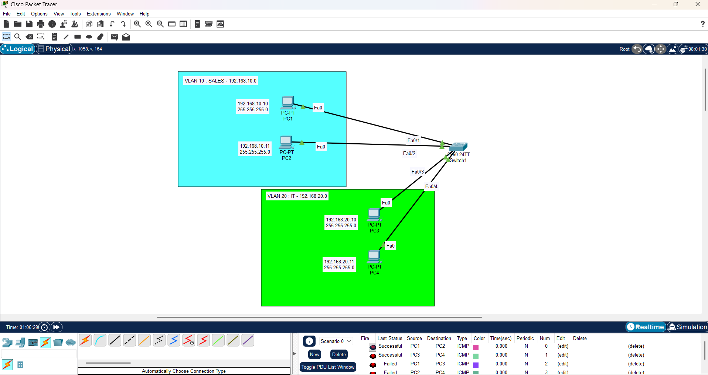

# Lab 06: VLANs on a Switch 

## Objective
Segment a LAN using VLANs and verify traffic isolation between VLANs.

## Topology

## VLAN Design
- VLAN 10 (SALES): PC1, PC2
- VLAN 20 (IT): PC3, PC4

## IP Addressing
- VLAN 10: 192.168.10.0/24
- VLAN 20: 192.168.20.0/24

## Switch Configuration
- Created VLAN 10 and VLAN 20
- Assigned access ports to VLANs
- Configured trunk port for multi-switch connectivity (optional)

## Verification
- Same-VLAN communication successful
- Inter-VLAN communication blocked (expected)

## Lessons Learned
- VLANs logically separate devices on the same switch
- Trunking allows multiple VLANs to traverse a single link

## Full Documentation
👉 [Google Drive – Lab 06 Documentation](https://drive.google.com/file/d/1pITtRfEvSwi52LVnOMRb9asbLeKjsrqY/view?usp=sharing)
